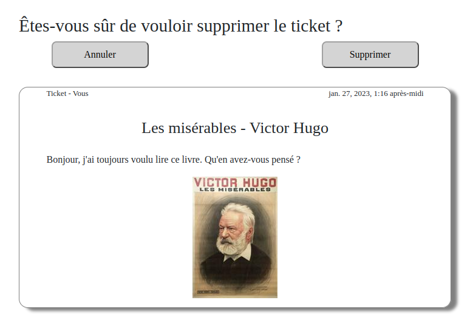

# Developpez-une-application-Web-en-utilisant-django
Projet 9 de la formation Openclassrooms Développeur d'application Python

## Description
Ce projet a pour objectif de répondre à la demande de MVP de la startup LITReview qui souhaite commercialiser un produit permettant à une communauté d'utilisateurs de consulter ou de solliciter une critique de livres à la demande.

L'application doit permettre de demander des critiques de livres ou d'articles en créant un ticket, mais également de publier des critiques de livres ou d'articles.

La disposition doit suivre la proposition des wireframes. L'interface utilisateur doit rester propre et minimale. 

Un utilisateur doit pouvoir : 
- se connecter et s'inscrire. Le site ne doit pas être accessible à un utilisateur non connecté ;
- consulter un flux contenant les derniers tickets et les commentaires des utilisateurs qu'il suit, classés par ordre chronologique, les plus récents en premier ;
- créer de nouveaux tickets pour demander une critique sur un livre/article ;
- créer des critiques qui ne sont pas en réponse à un ticket. Dans le cadre d'un processus en une étape, l'utilisateur créera un ticket puis un commentaire en réponse à son propre ticket ;
- voir, modifier et supprimer ses propres tickets et commentaires ;
- suivre les autres utilisateurs ;
- voir qui il suit et suivre qui il veut ;
- cesser de suivre un utilisateur.

## Procédure d'installation

### Import du dépôt Github
Dans un dossier de travail, importez le dépôt github puis, changez de répertoire courant pour vous positionner dans le répertoirecloné. 
```sh
$ git clone https://github.com/lcourdes/Developpez-une-application-Web-en-utilisant-django.git
$ cd Developpez-une-application-Web-en-utilisant-django
```

### Création d'un environnement virtuel
Il est recommandé d'installer un environnement virtuel. Pour ce faire, suivez les instructions 
ci-dessous :

- S'il ne l'est pas déjà, installez le package *virtualenv* :
```sh
$ pip install virtualenv
```

- Créez un environnement de travail et activez-le :
```sh
$ python3 -m venv env
$ source env/bin/activate
```

### Installation des librairies
Installez les librairies nécessaires au bon fonctionnement du programme à l'aide du fichier requirements.txt :
```sh
$ pip install -r requirements.txt
```

### Lancement du serveur

Pour démarrer le programme, déplacez-vous dane le projet Django et démarrer le serveur :
```sh
$ cd LITReview
$ python3 manage.py runserver
```

L'adresse est fournie dans le terminal et peut être ouverte dans un navigateur.

## En cours d'utilisation

### Création d'un compte utilisateur

L'interface utilisateur démarre sur une page qui propose soit de s'authentifier soit de créer un compte. Pour créer un nouveau compte, cliquez sur le bouton *S'inscrire*.


Il est demandé de renseigner un nom d'utilisateur et un mot de passe. Le nom d'utilisateur ne doit pas être déjà utilisé. De plus, le mot de passe doit contenir au moins huit caractères (alphanumériques). 

### Authentification

Une fois un compte créé, vous êtes redirigé sur la page d'authentification. Vous pouvez renseigner votre nom d'utilisateur et mot de passe dans la rubrique *Connectez-vous*. 


Pour accéder au contenu du site, cette étape est obligatoire. Dans le but de tester les fonctionnalités du site, vous avez également la possibilité de vous connectez avec les identifiants suivants : 

> Nom d'utilisateur : utilisateur1
>
> Mot de passe : motdepasse1

> Nom d'utilisateur : utilisateur2
>
> Mot de passe : motdepasse2

> Nom d'utilisateur : utilisateur3
>
> Mot de passe : motdepasse3

Une fois authentifié, vous êtes automatiquement redirigé vers la page de flux. Vous pouvez naviguer dans les différentes pages grâce aux liens *Flux*, *Posts* et *Abonnements*. Vous pouvez également vous déconnecter en cliquant sur le lien *Se déconnecter*. 


### Le flux

Dans le flux, apparaissent les contenus des utilisateurs auxquels vous êtes abonnés ainsi que vos propres contenus. Les contenus sont de deux sortes : 
- Les tickets. Il s'agit d'une demande de critique d'un livre ou d'un article de la part d'un utilisateur. 
- Les critiques. Il s'agit de critiques postées par des utilisateurs. 

En en-tête des tickets et des critiques on trouve le nom de l'auteur ainsi que la date de création. 


#### Création d'un ticket

Pour créer un nouveau ticket, il faut cliquer sur *Demander une critique*. Vous êtes alors redirigé vers la page de création d'un ticket. Un formulaire peut dès lors être rempli pour demander un avis sur un article ou un livre. 


Pour compléter ce formulaire, il est nécessaire de renseigner à minima un titre. La description est optionnelle. Pour ajouter une image à votre ticket, vous pouvez cliquez sur *Télécharger fichier*. Une prévisualisation de l'image est alors proposée. 

Une fois le formulaire complété, cliquez sur *Envoyer* pour poster votre ticket dans votre flux et dans le flux des utilisateurs abonnés à votre contenu. 

#### Création d'une critique

A partir de la page de flux, vous pouvez également proposer une critique d'un livre ou d'un article. Pour ce faire, vous pouvez répondre à une demande de critique ou créer une toute nouvelle critique. Dans le premier cas, vous pouvez cliquez sur le bouton *Créer une critique* qui est présent sous un ticket. Dans le deuxième cas, cliquez sur le bouton *Créer une critique* disposé en haut de votre flux. 

Quel que soit votre choix, vous êtes redirigé vers la page de création d'une critique. Le ticket est d'ores et déjà rempli en fonction du choix de création d'une critique. 

*Création d'une critique à partir d'un ticket existant*


*Création d'une critique sans ticket existant*


Concernant le remplissage du ticket, voir la section précédente. Pour remplir le formulaire, il est nécessaire de renseigner un titre et d'attribuer une note au livre allant de 0 à 5. Il est possible d'ajouter un commentaire à la critique. Une fois le formulaire complété, cliquez sur *Envoyer*. La critique s'affiche désormais dans votre flux et dans le flux des utilisateurs abonnés à votre contenu. 

NB: Lorsque une critique pour un ticket existe déjà, il n'est pas possible de créer une nouvelle critique. 

### Mes posts

Grâce à la barre de navigation vous pouvez vous rendre dans la section *Posts*. 

Dans la rubrique *Posts*, apparait votre contenu uniquement, ie. vos tickets et vos critiques. 


#### Modification et suppression

Pour chaque post, vous pouvez cliquer sur *Modifier* ou *Supprimer*.

En cliquant sur *Modifier*, vous accéder aux formulaires de création de ticket ou de critique à ceci près qu'ils sont préremplis avec les informations déjà existantes. Vous pouvez alors changer/ajouter n'importe quelle information. Enregistrez vos modifications en cliquant sur *Envoyer*.

En cliquant sur *Supprimer*, vous êtes redirigé vers une page qui demande de confirmer la suppression. 



### Abonnement

Grâce à la barre de navigation vous pouvez vous rendre dans la section *Abonnement*.


Vous pouvez suivre le contenu d'utilisateurs en déroulant le menu de la rubrique *Suivre d'autres utilisateurs* et en cliquant sur *Envoyer*.

La liste des utilisateurs dont vous suivez le contenu est présente dans la rubrique *Abonnements*. Vous pouvez à tout moment vous désabonner du contenu d'un utilisateur en cliquant sur le bouton *Se désabonner* correspondant.

Vous trouvez dans la rubrique *Abonnés* la liste des utilisateurs qui suivent votre contenu.

## Lien Github

[](https://github.com/lcourdes/Developpez-une-application-Web-en-utilisant-django)
